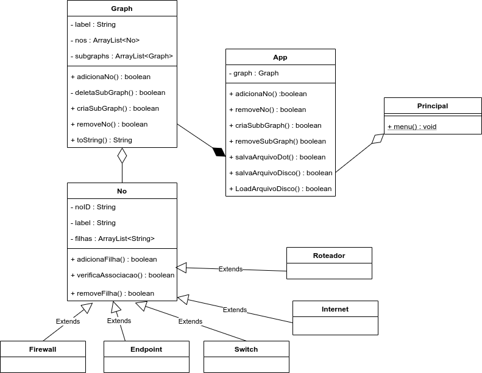
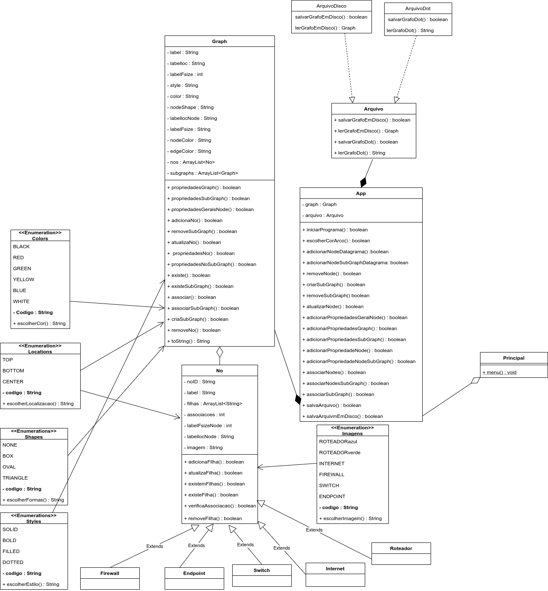

# Projeto

Nome: Jefferson Botitano 

## Diagrama Inicial

## Diagrama Final 

### Funcionalidades Implementadas

* Cria Grafo
* Cor para igual para todos os Arcos
* Adiconar Nodos
* Cria Subgrafo
* Remove Nodo
* Atualiza Nodo
* Remove Subgrafo
* Adiciona Propriedades para todos os nodos
* Adiciona Propriedades para um Nodo especifico
* Adicona Propriedades para um grafo
* Adiciona Propriedades para um Subgrafo.
* Associa Nodos
* Salva grafo em um arquivo Dot
* Salva grafo em Disco
* Verifica se os nodos seguem as regras do Datagrama (Ocorre dentro Salvamento do Arquivo)

### Funcionalidades Não Implementadas

* Cor para um arco especifico
* Carregar um arquivo salvo em Disco

### Problemas Encontrados

* Durante o Desenvolvimento do projeto, vários métodos/classes/atributos não previstos inicialmente tiveram de ser implementados.
* Por conta do meio de como desenvolvi a associação entre os nodos, colocar uma cor para um Arco especifico não foi possível.
* Os teste poderiam ter sido desenvolvidos de uma maneria mais profissional.(Os testes ocorrem de forma sequencial.)
* Dificulades para testar o Carregamento do arquivo salvo em disco.(Por este motivo não consegui implementa-ló, método está na Classe Arquivo.)